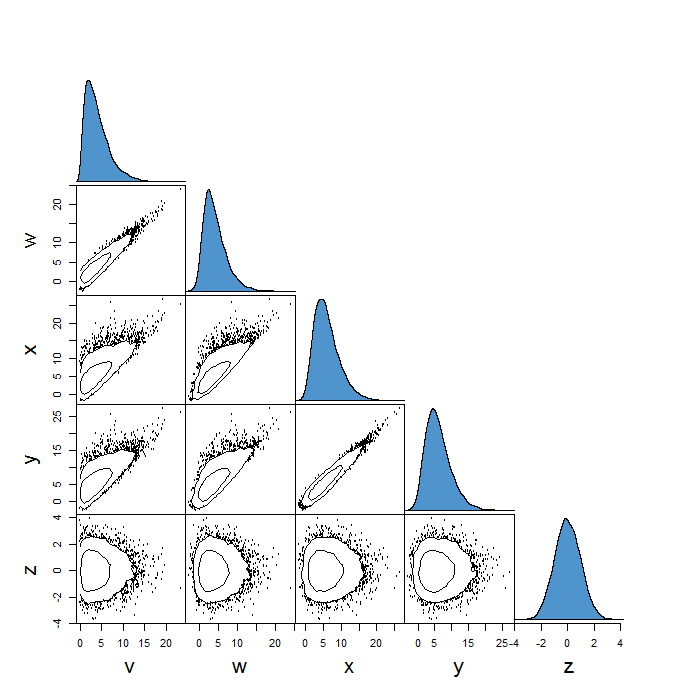

# tonic 

Tonic is a collection of pure R tools for generating and manipulating MCMC output.
It is also a nice [mixer](https://en.wikipedia.org/wiki/Tonic_water). 


The current version includes the top-level functions:

 * gw_sampler        - sample a target density using the ensemble sampler of Goodman & Weare (2010)
 * mh_sampler        - sample a target density using the random walk M-H method 
 * contour_matrix    - plot an NxN matrix summarising pairwise relationships between variables
 * chain_convergence - make diagnostic plots of chain outputs

## Installation

Tonic is an R package, but is still in development. To set up from GitHub first install (if you haven't already) Hadley Wickham's devtools package.
```
   install.packages("devtools")
```
Now you can install tonic straight from GitHub:
```
   devtools::install_github("svdataman/tonic")
```
It will also install the [mvtnorm](https://cran.r-project.org/web/packages/mvtnorm/index.html) package which it depends on. Now you're good to go.

## Sampling

Let's define a psterior to sample. Tis should be an R function that takes a vector of parameters as its first argument, and returns a (scalar) log density (up to some normalisation constant). Here we'll use a multivariate normal as a simple example.

```R
  my_posterior <- function(theta) {
    cov <- matrix(c(1,0.98,0.8,0.98,1.0,0.97,0.8,0.97,2.0), nrow = 3)
    logP <- mvtnorm::dmvnorm(theta, mean = c(-1, 2, 0), sigma = cov, log = TRUE)
    return(logP)
  }
```
Now we can generate a sample from this posterior using e.g.
```R
   chain <- tonic::gw_.mcmc_sampler(my_posterior, theta.0 = c(0,0,0), nsteps = 1e4)
```
The output is list (chain) containing, among other things, an array (theta) with
$10^4$ samples.

Note: there is a `burn in' period (of 2000, by default). This means the first 
few iterations are thrown away (not returned). 

## Visualising

We can visualise the multivariable output of this using the contour_matrix function.
```R
  tonic::contour_matrix(chain$theta)
```
The [i,j] panel shows the theta[,i] variable plotted against th theta[,j] variable. 
Here we plot density contours, and points for data beyond the outermost contour. 
Along the diagonal ([i,i] panels) we show the density or histogram of variable theta[,i].

This is an extension of the plot (Fig. 2) used in [Vaughan 2010, MNRAS, v402, pp307-320](http://adsabs.harvard.edu/abs/2010MNRAS.402..307V).

Below is an example plot for a five-variable problem.



## Help

For more help on each comment, try the in-built help, e.g.
```R
   ?gw_sampler
   ?mh_sampler
   ?contour_matrix
   ?chain_convergence
```

## To do

* complete documentation of functions
* annealing? (with evidence calculation)
* evidence from nested sampling?
* periodic saving of output
* configure input/output so that can pick-up chain(s) where left off.
* add Laplace evidence function, MAP finder
 
## Referencing tonic

If you find tonic useful in your work, please cite the following paper for
which tonic was developed:

[S. Vaughan et al., 2016, MNRAS, v461, pp3145-3152](http://adsabs.harvard.edu/abs/2016MNRAS.461.3145V)
