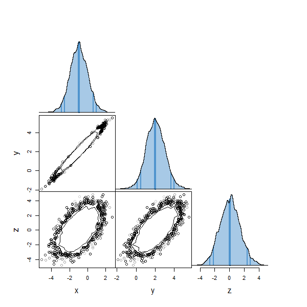

# tonic 

Tonic is a collection of pure R tools for generating and manipulating MCMC output.
It is also a nice [mixer](https://en.wikipedia.org/wiki/Tonic_water). 


The current version includes the top-level functions:

 * gw_sampler        - sample a target density using the ensemble sampler of Goodman & Weare (2010)
 * mh_sampler        - sample a target density using the random walk M-H method 
 * contour_matrix    - plot an NxN matrix summarising pairwise relationships between variables
 * chain_convergence - make diagnostic plots of chain outputs

## Installation

Tonic is an R package, but is still in development. To set up from GitHub first install (if you haven't already) Hadley Wickham's devtools package.
```
   install.packages("devtools")
```
Now you can install tonic straight from GitHub:
```
   devtools::install_github("svdataman/tonic")
```
It will also install the [mvtnorm](https://cran.r-project.org/web/packages/mvtnorm/index.html) package which it depends on. Now you're good to go.

## Sampling

Let's define a posterior to sample. This should be an R function that 
* takes a vector of parameters as its first argument,
* returns a (scalar) log density (up to some normalisation constant,
* return -Inf where the posterior is zero (e.g. because prior is zero).
Here we'll use a multivariate normal as a simple example.

```R
  my_posterior <- function(theta) {
    cov <- matrix(c(1,0.98,0.8,0.98,1.0,0.97,0.8,0.97,2.0), nrow = 3)
    logP <- mvtnorm::dmvnorm(theta, mean = c(-1, 2, 0), sigma = cov, log = TRUE)
    return(logP)
  }
```
Now we can generate a sample from this posterior using the Goodman-Weare algorithm as follows.
```R
   chain <- tonic::gw_sampler(my_posterior, theta.0 = c(0,0,0), nsteps = 1e4)
```
The output is list (chain) containing, among other things, an array (theta) with
10,000 samples. 
* You must specify the name of the posterior function and the
initial values for parameters (theta.0). 
* You may change the number of walkers (default: nwalkers = 100).
* For a list of other parameters (optional), see the built-in help.

Note: there is a `burn in' period (of 2,000 samples, by default). This means the first few iterations are thrown away (not returned). 

Or use the random walk Metropolis-Hastings algorithm:
```R
   chain <- tonic::mh_sampler(my_posterior, theta.0 = c(0,0,0), nsteps = 1e4)
```
In this case the acceptance rate (see below) is rather low. We can improve this
by 
* manually specifying a more suitable covariance matrix (set cov parameter equal to a valid covariance matrix).
* adapting the proposal distribution based on the samples from the `burn in' period (set adapt = TRUE).
By default we produce the nsteps samples by merging the output from nchains
independent chains (default: nchains = 5).

## Assessing output

It is a good idea to check the output. First, check the average acceptance rate:
```R
   print(chain$accept.rate)
```

One usually aims for a value in the range 0.1-0.8.

Now check the behaviour of the chains. The chain_diagnosis() function plots, for each parameter of the posterior, the traces of each walker (gw) or
chain (mh), the ACFs and the distributions. 
```R
  tonic::chain_diagnosis(chain)
```


Here we see the chains seem to be long enough (ACF decays to zero, trace plots
show no outlying walkers or trend in the mean, ...). For more details of what
is shown, see the built-in help.

## Visualising

We can visualise the multivariate samples using the contour_matrix() function.
```R
  tonic::contour_matrix(chain$theta, prob.levels = c(0.9, 0.99), smooth1d = TRUE)
```
The [i, j] panel shows the theta[, i] variable plotted against the theta[, j] variable. We plot density contours enclosing 90\% and 99\% of the mass, and points for samples beyond the outermost contour. Along the diagonal ([i, i] panels) we show the (smoothed) density (optionally: histogram) of variable theta[, i].

This is a development of the code used to produce Fig. 2 of [Vaughan 2010, MNRAS, v402, pp307-320](http://adsabs.harvard.edu/abs/2010MNRAS.402..307V), and is based on the pairs() plots of base R.



## Help

For more help on each comment, try the in-built help, e.g.
```R
   ? tonic::gw_sampler
   ? tonic::mh_sampler
   ? tonic::contour_matrix
   ? tonic::chain_convergence
```

## To do

* annealing? (with evidence calculation)
* evidence from nested sampling?
* periodic saving of output
* configure input/output so that can pick-up chain(s) where left off.
* add Laplace evidence function, MAP finder
 
## Referencing tonic

If you find tonic useful in your work, please cite the following paper for
which tonic was developed:

[S. Vaughan et al., 2016, MNRAS, v461, pp3145-3152](http://adsabs.harvard.edu/abs/2016MNRAS.461.3145V)
